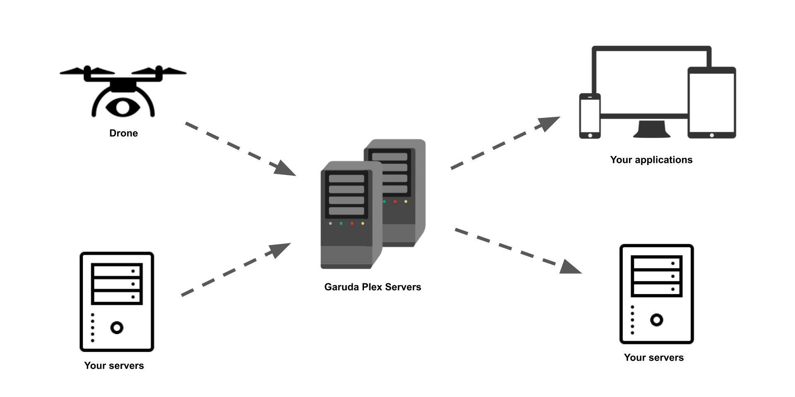
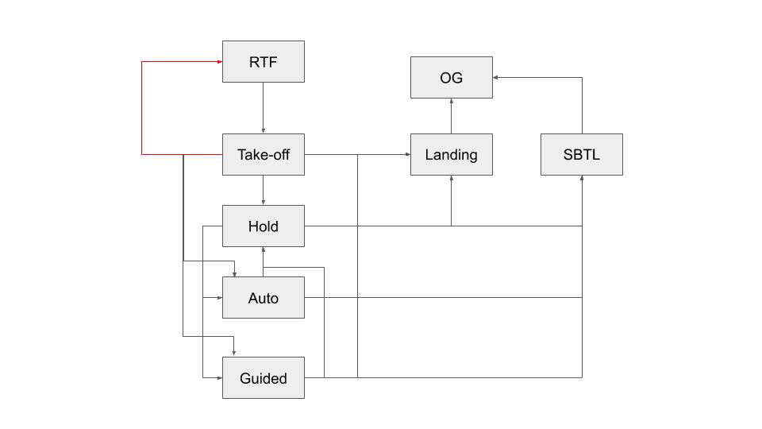

## Telemetry

A drone `telemetry` consists of simple data and relevant information about your drone flight, including the **location** (lat, long), **altitude**, **position**, **speed**, **power consumption**, **system** and **battery** information of your drone. Usually recorded and logged either in real-time or post-flight, telemetry of your flight gives you vital information about the condition of your drone, what it is doing, it's surroundings at each point of the flight, and more.

**Garuda Plex Telemetry APIs** allow you to submit and receive telemetry. This is done via web socket connections. 

> 

The diagram (on the right) and explanation below briefly details how telemetry (and other diagnostics from the drone) is passed from the drone (or your servers) in live flight to our servers and then back down to consumers/users like yourself.

1. During a live flight, you can submit telemetry data via Garuda Plex Telemetry APIs using a web socket connection. This can be done either from the drone directly (if your drone supports it), or via your own service(s) that can support web socket connections.
2. These `telemetry` data will be pushed into our database servers, and also a telemetry web service we are running that exposes a web socket to allow users to consume the same data as well.
3. This data can then be displayed on either a frontend of your choice, or simply logged to your own servers.

Each of these `telemetry` object is a JSON object that has the following format and properties:

```json
{
  "droneId": "4e63faa7eb83cb0f3dfc498c5020a35e",
  "timestamp": "1560495518277",
  "lat": "30.30516",
  "long": "-214.74836",
  "alt": "100.00",
  "yaw": "-6.94",
  "pitch": "0.00",
  "roll": "0.00",
  "agl": "100.00",
  "flightState": "init",
  "failsafe": "None",
  "flightTime": "3600000",
  "velocity_x": "10.00",
  "velocity_y": "10.00",
  "velocity_z": "10.00",
  "battVolt": "12587.00",
  "battCurr": "12587.00",
  "battLife": "100.00",
  "satCount": "10",
  "gpsHAcc": "121",
  "gpsVAcc": "65535",
  "homeLat": "30.305168",
  "homeLong": "-214.7483648",
  "homeAlt": "None",
  "rssi": "123.123",
  "networks": [
       {
          "id" : "AreteM",
          "ip" : "10.11.12.13",
          "rssi" : "-53",
          "quality" : "good",
          "status" : "active",
          "statusnum" : "12",
          "log" : { "..." }
       },
       {
          "id" : "SingTel",
          "ip" : "100.101.102.103",
          "rssi" : "-69",
          "quality" : "good",
          "status" : "selected",
          "statusnum" : "12",
          "log" : { "..." }
       }
    ]
}
```

| Property       | Type    | Description                                                                               |
| -------------- | ------- | ----------------------------------------------------------------------------------------- |
| `droneId`      | String  | Drone ID of this telemetry                                                                |
| `timestamp`    | Number  | Timestamp of telemetry in epoch (Unix timestamp), converted to milliseconds               |
| `lat`          | Number  | Telemetry latitude, to 5 decimal places                                                   |
| `long`         | Number  | Telemetry longitude, to 5 decimal places                                                  |
| `alt`          | Number  | Altitude above mean sea level, in meters. (2 decimal places)                              |
| `agl`          | String  | Altitude above ground level, in meters. (2 decimal places)                                |
| `yaw`          | String  | Drone yaw degree (-180 deg to 180 deg)                                                    |
| `pitch`        | String  | Drone pitch degree (-90 deg to 90 deg)                                                    |
| `roll`         | String  | Drone roll degree (-180 deg to 180 deg)                                                   |
| `flightState`  | String  | Enumerated string of flight states of the drone                                           |
| `daaState`     | Boolean | Boolean to indicate if DAA has been activated                                             |
| `failsafe`     | String  | Current fail safe status if its activated                                                 |
| `flightTime`   | String  | Flight time in milliseconds                                                               |
| `velocity_x`   | Number  | Velocity in x-direction in meters per second, using the North-East-Down coordinate system |
| `velocity_y`   | Number  | Velocity in y-direction in meters per second, using the North-East-Down coordinate system |
| `velocity_z`   | Number  | Velocity in z-direction in meters per second, using the North-East-Down coordinate system |
| `battVolt`     | String  | Battery voltage, in volts, up to 2 decimal places                                         |
| `battCurr`     | String  | Battery current output, in amperes, up to 2 decimal places                                |
| `battLife`     | String  | battery charge remaining in percentage (0 - 100%)                                         |
| `satCount`     | String  | Number of GPD satellites that drone is connected to                                       |
| `gpsHAcc`      | String  | GPS Horizontal accuracy in metres measures up to micrometres                              |
| `gpsVAcc`      | String  | GPS Vertical accuracy in metres measures up to micrometres                                |
| `homeLat`      | String  | Latitude of home point                                                                    |
| `homeLong`     | String  | Longitude of home point                                                                   |
| `homeAlt`      | String  | Altitude of home point, in meters above mean sea level                                    |
| `rssi`         | String  | Received signal strength indicator on connected network (by percentage)                   |
| `network` | Array  |  List of network info objects with each of the object represents the current status of corresponding networks provided to GCC                                                           |


The flight states of the drone follows a state diagram and changes depending on at which state of the flight the drone is in:

> 

| Flight States | Description                                                                                             |
| ------------- | ------------------------------------------------------------------------------------------------------- |
| `RTF`         | Drone is ready to fly                                                                                   |
| `TAKE OFF`    | When the command has been given to take off. NOTE: DJI does not have arm procedure whereas Mavlink has. |
| `HOLD`        | When the drone is not moving in air                                                                     |
| `AUTO`        | When the drone is executing the current mission plan.                                                   |
| `GUIDED`      | When the drone is in manual navigation, going to specific point, etc.                                   |
| `LAND`        | When the drone is landing.                                                                              |
| `OG`          | When the drone has landed (on ground).                                                                  |

The breakdown of network info in the telemetry:

| Network property       | Type    | Description                                                                                                                                                                                                                                                                                      |
| ---------------------- | ------- | ------------------------------------------------------------------------------------------------------------------------------------------------------------------------------------------------------------------------------------------------------------------------------------------------ |
| `id`                   | String  | ID which assigned to corresponding network by Garuda Robotics                                                                                                                                                                                                                                    |
| `ip`                   | String  | IPv4 address of the network                                                                                                                                                                                                                                                                      |
| `rssi`                 | String  | RSSI (Received signal strength indication) of the network which should be number in string. This value indicates how good the GCC network module can sense the network base station nearby.                                                                                                      |
| `quality`              | String  | The network quality which can be either of good, caution and bad. This value is computed based on the network module specs and its current RSSI value. This value indicates how good is the network condition.                                                                                   |
| `status`               | String  | The network status which can be either of active, selected and error. The active status means the network is active to use but it's not used by GCC now. The selected status means the network is current used by GCC. The error status means the network is currently not available to be used. |
| `statusnum`            | String  | The numeric flag indicates the network conditions. Noted that this number is *ONLY* available while using SCM.                                                                                                                                                                                   |
| `log`                  | Object  | The log given by network modules (either DLM or SCM) as current network status record. This object is highly cosutomised by DLM and SCM which used for debug purpose.                                                                                                                            |

## DAA (Detect and Avoid) Telemetry

DAA telemetry is the information generated from DAA related devices built-in on the drone. DAA telemetry consists of the information of the obstacles detected in front of the drone.

The breakdown of DAA telemetry:

| Property       | Type    | Description                                                                               |
| -------------- | ------- | ----------------------------------------------------------------------------------------- |
| `droneId`      | String  | Drone ID of this telemetry                                                                |
| `obstacles`    | Object  | Information of the obstacles detected by DAA                                              |

The breakdown of obstacle object:

| Property       | Type    | Description                                                                               |
| -------------- | ------- | ----------------------------------------------------------------------------------------- |
| `x1`           | String  | Leftmost x coordinate of the coordinate bounds                                            |
| `x2`           | String  | Rightmost x coordinate of the coordinate bounds                                           |
| `y1`           | String  | Leftmost y coordinate of the coordinate bounds                                            |
| `y2`           | String  | Rightmost y coordinate of the coordinate bounds                                           |
| `d`            | String  | Distance of the obstacle from the drone                                                   |
| `t`            | String  | The detected the obstacle with the corresponding information                              |

### Submitting telemetry

Garuda Plex APIs uses web sockets to receive telemetry from users. Given an `access_token`, `drone_id` and your `company_id`, you will be able to connect to the web socket and send live telemetry.

<div class="center-column"></div>
```
wss://<URL>?access_token=<ACCESS_TOKEN>&companyId=<COMPANY_ID>&droneId=<DRONE_ID>
```

This web socket will accept incoming messages that conforms to the `telemetry` JSON object defined above.

There are many ways you can implement a server to send web socket messages. Listed below is a quick example using a Google Chrome extension and also an example with a NodeJS library and Javascript.

**With Google Chrome extension [Simple WebSocket Client](https://chrome.google.com/webstore/detail/simple-websocket-client/pfdhoblngboilpfeibdedpjgfnlcodoo)**

This is a lightweight extension for Google Chrome that gives you a very simple interface that allows you to establish a web socket connection as a client with a listening server, and send/receive message through the web socket.

After [installing the extension](https://chrome.google.com/webstore/detail/simple-websocket-client/pfdhoblngboilpfeibdedpjgfnlcodoo) in Google Chrome, simply open up the extension, which will bring you to a new tab with the application UI.

You should see that under `Server Location`, the `STATUS` should be `CLOSED`.

With your `access_token`, `drone_id` and `company_id` entered as query parameters into the URL above, simply paste it into the URL textfield and click on `Open`. 

The `STATUS` should change to `OPENED` once the web socket connection has been successfully established, and you can start to send telemetry under the `REQUEST` section.

**With NodeJS and Javascript**

*This example assumes you already have NodeJS installed on your machine*

Implementing a web socket client using Node and Javascript is also very simple and straightforward. The npm library [`websocket`](https://www.npmjs.com/package/websocket) allows you to spin up a web socket client very quickly with minimal code.

To install this library, `cd` into your Node project directory and run `npm install websocket`.

Download the two sample files provided here to get started quickly. The first file is the source code for running the web socket client, while the second file provides some mock telemetry data (10 in total) for testing out this service.

[ws-send-telem.js](../downloads/fleet.md)

[mock-telemetry.js](#)

**NOTE: Remeber to replace `<ACCESS_TOKEN>`, `<DRONE_ID>` and `<COMPANY_ID>` with the appropriate values.**

Lastly, run the project with `node ws-send-telem.js` and your client should be connected to the web socket server and sending telemetry defined in `mock-telemetry.js`. Each time you run the node program, a telemetry message will be sent every 1 second to our servers. Feel free to change the frequency of the telemetry or the total number of telemetry to be sent by editing the source files.

### Getting live telemetry

After sending the telemetry, you will also be able to listen and retrieve this telemetry with another web socket client. Receiving telemetry is done on a company wide level.

<div class="center-column"></div>
```
wss://<URL>?access_token=&company_id=
```

**With Google Chrome extension [Simple WebSocket Client](https://chrome.google.com/webstore/detail/simple-websocket-client/pfdhoblngboilpfeibdedpjgfnlcodoo)**

Instructions for the extension is similar to the sender above.

With your `access_token` and `company_id` entered as query parameters into the URL above, simply paste it into the URL textfield and click on `Open`. 

The `STATUS` should change to `OPENED` once the web socket connection has been successfully established, and you should start to receive the telemetry data in raw JSON format in the message log console during your live flight.

```javascript
var WebSocketClient = require('websocket').client;
 
var client = new WebSocketClient();
 
client.on('connectFailed', function(error) {
    console.log('Connect Error: ' + error.toString());
});
 
client.on('connect', function(connection) {
    console.log('WebSocket Client Connected');
    connection.on('error', function(error) {
        console.log("Connection Error: " + error.toString());
    });
    connection.on('close', function() {
        console.log('echo-protocol Connection Closed');
    });
    connection.on('message', function(message) {
        if (message.type === 'utf8') {
            console.log("Received: '" + message.utf8Data + "'");
        }
    });
    
    function sendNumber() {
        if (connection.connected) {
            var number = Math.round(Math.random() * 0xFFFFFF);
            connection.sendUTF(number.toString());
            setTimeout(sendNumber, 1000);
        }
    }
    sendNumber();
});
 
client.connect('wss://<URL>?access_token=<ACCESS_TOKEN>&company_id=<COMPANY_ID>', 'echo-protocol');
```

**With NodeJS and Javascript**

*This example assumes you already have NodeJS installed on your machine*

We will use the same npm library, [`websocket`](https://www.npmjs.com/package/websocket), to implement the receiver for the telemetry.

Next, create a file `ws-receive-telem.js` and paste the provided example code on the right into it. Remeber to replace `<ACCESS_TOKEN>` and `<COMPANY_ID>` with the appropriate values. **NOTE: Select the `javascript` tab at the top of the code section if you don't see the example code!**

Alternatively, you can download the file directly: [ws-receive-telem.js](#)

Run the project with `node ws-receive-telem.js` and your client should be connected to the web socket server and listening for telemetry. Once your drone is in active flight and telemetry is being logged, you should see the telemetry JSON objects printed out on the console.
